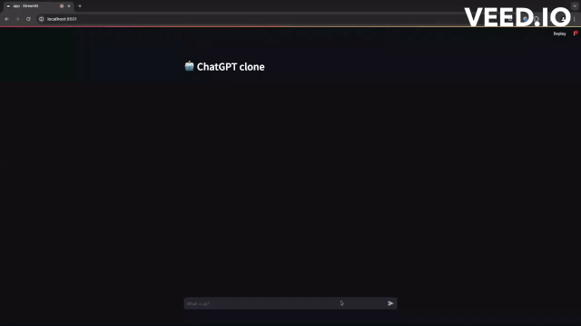

# ChatGPT clone
This is a functional ChatGPT clone built with streamlit and the OpenAI API.

# Project steup
Create a virtual python environment using the following command
`python -m venv <virtual env name>`

Suppose our environment is called *venv*

Next, activate the virtual environment and install project dependencies
1. `source venv/bin/activate`
2. `pip install -r requirements.txt`

# Launch app
Launch the application locally using the following command
`streamlit run app.py`

